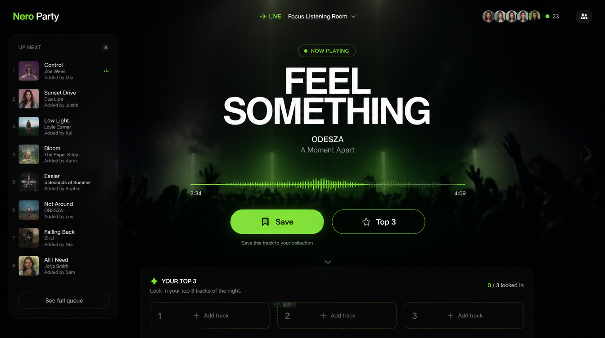
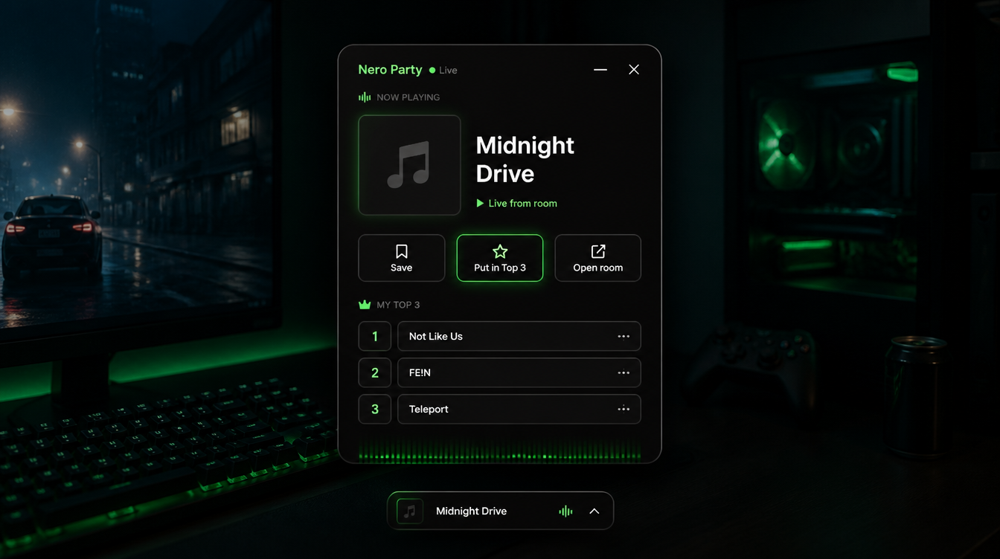
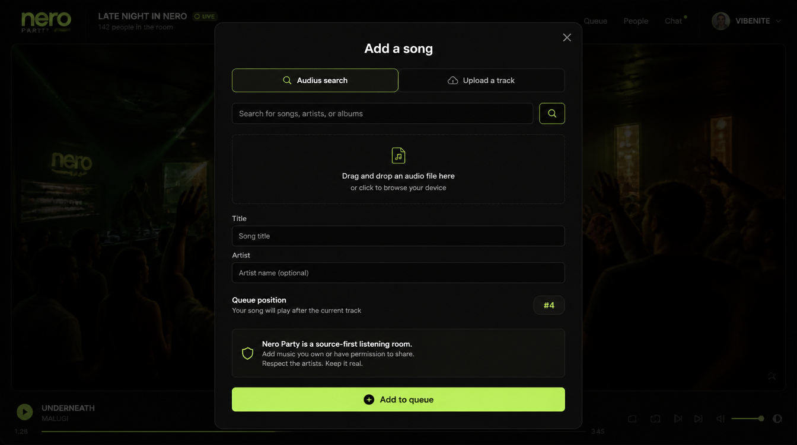
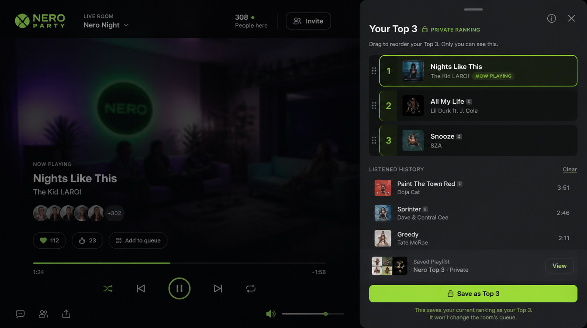
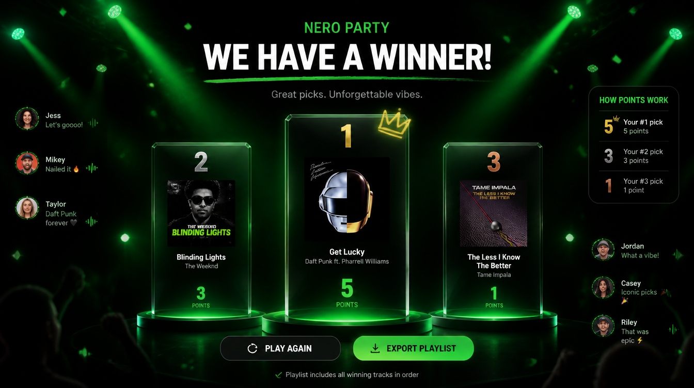
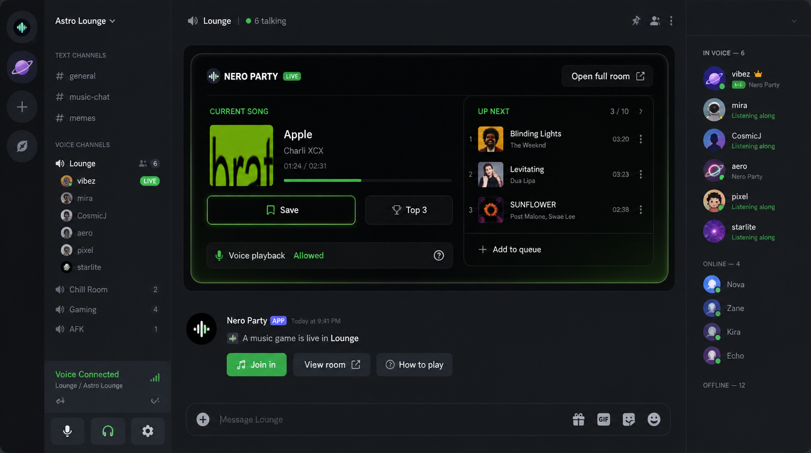
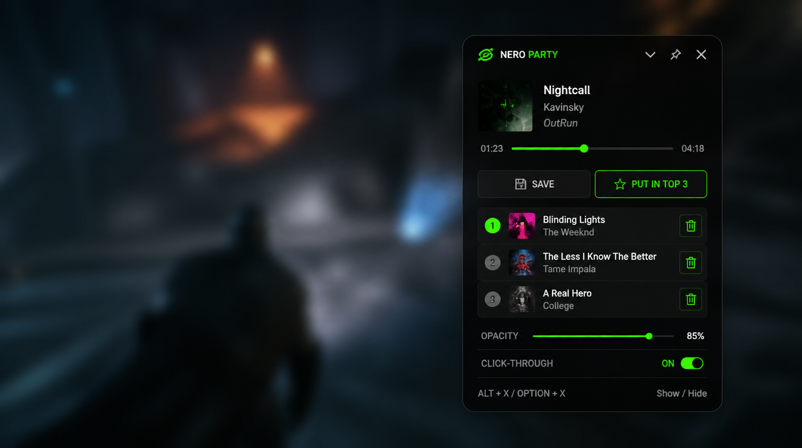
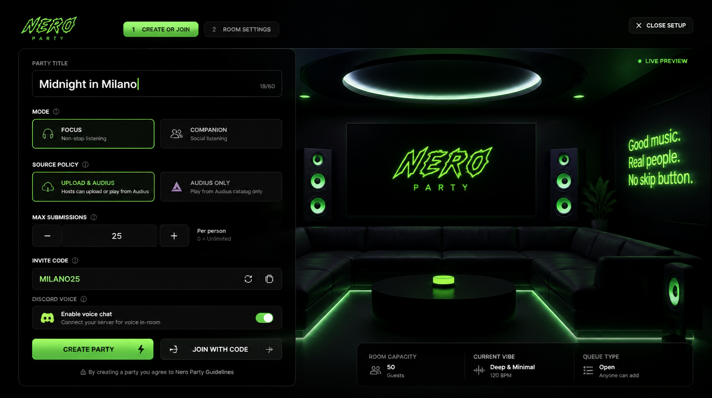

# Nero Party

Nero Party is a private-beta music game for full-song listening parties. It is being built around one server-authoritative party state and these surfaces/modules:

- `apps/web`: Focus Mode live room plus an in-room overlay preview.
- `apps/server`: Express, Socket.IO, Prisma, Uploads + Audius playback coordinator, and Spotify listener-device playback.
- `apps/discord-bot`: Parked for now; not part of the current demo surface.
- `apps/desktop`: Electron always-on-top overlay for macOS and Windows.
- `packages/shared`: TypeScript schemas, types, ranking, and scoring.
- `packages/player`: Upload, Audius, and optional Spotify source adapters.

Hard source policy: production full songs come from user uploads, Audius streams, or each listener's own Spotify playback device. Nero does not extract YouTube audio, rip video platforms, or rebroadcast hidden catalog audio.

## Local Setup

```bash
npm install
cp .env.example .env
# Edit DATABASE_URL to an absolute local SQLite path.
npm run prisma:generate
npm run prisma:push
npm run dev
```

Local URLs:

- Web: `http://localhost:5173`
- Server: `http://localhost:3000`
- Overlay preview: open from the room's `Overlay` button.

## Environment

`DATABASE_URL=file:./dev.db` is the local default. Production should use Postgres on Supabase or Neon.

Key variables:

- `CLIENT_URL`: browser origin allowed by the API.
- `PUBLIC_API_URL`: public API URL used for upload stream URLs.
- `PUBLIC_WEB_URL` / `NERO_WEB_URL`: web surface used by overlay and follow-up links.
- `AUDIUS_API_BASE`: Audius API base.
- `SPOTIFY_CLIENT_ID`, `SPOTIFY_CLIENT_SECRET`, `SPOTIFY_REDIRECT_URI`: Spotify OAuth for listener-device playback. Add the redirect URI in the Spotify Developer Dashboard.
- `SPOTIFY_SCOPES`: defaults to `streaming user-modify-playback-state user-read-playback-state user-read-currently-playing`.

## Product Flows

Create Party: host picks title, song cap, total timebox, per-listener submission limit, voting lock window, and allowed sources before starting a focused live room.

Join Party: guests join by web link. Desktop deep links remain a production follow-up.

Full Song Submission: Audius search, Spotify search, or MP3/WAV/FLAC/AAC/MP4 upload when enabled by the host. The API enforces per-listener, room song, source, and total-duration limits. Uploaded files are served by the API locally and should move to Supabase Storage or R2/S3 in production.

Spotify Listener Playback: each listener who wants Spotify audio connects their own Premium, allowlisted Spotify account and opens Spotify on their playback device. When a Spotify track starts or advances, Nero sends the same track URI to each linked listener device.

Simple Background Flow: the overlay shows now playing, `Save`, `Top 3`, and the user's current ballot.

Full Ranking Flow: Focus Mode includes a ranking bay where listened songs can be inserted, dragged, and reordered.

Finale: each participant's current Top 3 becomes the ballot. Scoring is 5/3/1 with tie-breaks by first-place votes, appearances, then earlier queue position.

## Visual Direction

These design reference mockups are direction-finding artifacts, not production UI assets. Use them for composition, density, mood, and interaction shape only. Do not ship their placeholder artists, album art, logos, or platform-like content.

The strongest implementation anchors are the Focus listening room, Add song modal, Top 3 drawer, Final reveal, and Desktop overlay. See the full notes in [docs/design/reference-mockups/README.md](docs/design/reference-mockups/README.md).

<table>
  <tr>
    <td width="50%">
      <strong>Focus listening room</strong><br />
      
    </td>
    <td width="50%">
      <strong>Companion remote</strong><br />
      
    </td>
  </tr>
  <tr>
    <td width="50%">
      <strong>Add song modal</strong><br />
      
    </td>
    <td width="50%">
      <strong>Top 3 drawer</strong><br />
      
    </td>
  </tr>
  <tr>
    <td width="50%">
      <strong>Final reveal</strong><br />
      
    </td>
    <td width="50%">
      <strong>Discord Activity</strong><br />
      
    </td>
  </tr>
  <tr>
    <td width="50%">
      <strong>Desktop overlay</strong><br />
      
    </td>
    <td width="50%">
      <strong>Create and join</strong><br />
      
    </td>
  </tr>
</table>

## Overlay Plan

Current demo path: the room's `Overlay` button opens a web preview of the compact companion surface against a game-like backdrop. This validates the background-use interaction model without pretending it is an OS-level overlay.

Fast web follow-up: Chrome Document Picture-in-Picture can float the compact Nero controls in an always-on-top browser-owned window. This is useful for demoing the feel quickly, but it will not cover global hotkeys, tray/menu-bar presence, click-through behavior, autolaunch, signed installers, or reliable over-game behavior.

Native follow-up: Electron remains the production path for a real macOS/Windows overlay. It should wrap `/companion/:code?source=overlay`, support `nero-party://join?code=ROOM`, provide global `Alt+X` / `Option+X` toggle behavior, collapse into a small click-through pill, expose opacity and tray/menu-bar controls, persist settings, and ship signed installers.

Non-goal: Nero should not inject into games, hook graphics APIs, scrape protected playback, or capture/rebroadcast hidden catalog audio. The overlay is a floating Nero remote over the same server-authoritative party state.

## TODO

- [ ] Tighten the in-room overlay preview so it uses real party state, keeps only now playing, `Save`, `Top 3`, current ballot, collapse state, and the minimum settings needed to prove the concept.
- [ ] Web global overlay follow-up: implement Chrome Document Picture-in-Picture using the same companion/overlay component, with a clear browser-support fallback back to the in-room preview.
- [ ] Native overlay follow-up: keep Electron for production-grade macOS/Windows overlay distribution, including global `Alt+X` / `Option+X`, tray/menu-bar controls, click-through, opacity, deep links, auto-launch, and persisted overlay settings.
- [ ] Overlay validation pass: test over a real game or fullscreen/borderless app, verify focus changes do not break party state, and confirm the collapsed pill does not block gameplay.
- [ ] Mockup implementation pass: translate the strongest references from [docs/design/reference-mockups/README.md](docs/design/reference-mockups/README.md) into the real app, especially `01-focus-room.png`, `03-add-song-modal.png`, `04-top3-drawer.png`, `05-final-reveal.png`, and `07-desktop-overlay.png`.
- [ ] Mockup cleanup rule: do not ship generated fake artists, album art, logos, or platform lookalikes from the mockups; use real uploaded/Audius metadata or neutral placeholders.

## Development Commands

```bash
npm run dev              # server + web
npm run dev:web
npm run dev:server
npm run dev:desktop
npm run typecheck
npm run test
npm run build
```

Desktop installers:

```bash
npm run dist:mac --workspace @nero/desktop
npm run dist:win --workspace @nero/desktop
```

Signing, notarization, and Windows code-signing credentials are intentionally external to the repo.

## Production Topology

- Web: Vercel or Cloudflare Pages.
- API/realtime: Fly.io or Render Node service for long-lived Socket.IO.
- DB: Supabase or Neon Postgres.
- Storage: Supabase Storage or R2/S3.
- Redis: Upstash for Socket.IO scaling, rate limits, presence, and jobs.
- Observability: Sentry, structured logs, uptime checks, and basic product analytics.

See [private beta runbook](docs/releases/private-beta-runbook.md) and [Design Council + Hailey review](docs/reviews/design-council-hailey.md).
